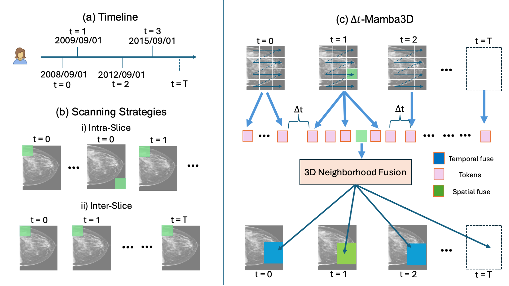

# 🐍 ∆t-Mamba3D: A Time-Aware Spatio-Temporal State-Space Model for Breast Cancer Risk Prediction 
   
Full paper + Appendix available on arXiv  

A Mamba-based spatiotemporal framework that models irregular-interval longitudinal mammography exams for **early cancer risk prediction**.  This repository provides official PyTorch implementation.

---

## 📌 Overview

Early cancer detection relies on modeling the temporal evolution of breast tissue across prior screening exams.
However, most existing approaches treat mammograms independently or fail to capture meaningful temporal dependencies, especially when exams occur at irregular intervals.

**LongitudinalMamba** introduces:

✔️ **Δt-aware state space modeling**  
✔️ **3D spatial–temporal feature mixing**  
✔️ **Performance improves with more priors**  
✔️ **Superior performance over Time-aware and Spatial-temporal baselines**

---

## 📊 Method Summary

  

**Figure:** (a) Illustration of a patient’s sequential imaging data acquired with irregular inter-visit gaps ∆t (e.g., 2008 → 2012
→ 2015). (b) Different scanning strategies for spatio-temporal feature volumes. (c) The scanning mechanism in the proposed
method ∆t-Mamba3D: time-aware scan modulated by inter-visit gaps ∆t with learnable multi-scale 3D neighborhood fusion.

---

## 📁 Repository Structure

